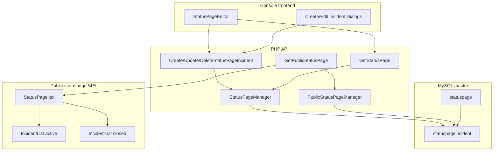

# Status page manual incidents (v1)

Design for letting users create and manage incidents from the console. Incidents belong to a status page, are stored in the master MySQL database, and appear on the public status page: **all active incidents prominently at the top**, **closed incidents from the last 30 days** in a past-incidents section. The console shows the full incident history for management.

No Chronos/Thrift changes — incidents are page metadata only, separate from automated monitor threshold alerts.

## Architecture



## Data model

Add table `statuspageincident` to [`database/struct_master.sql`](../database/struct_master.sql) and a one-time upgrade script [`database/upgrade_statuspage_incidents.sql`](../database/upgrade_statuspage_incidents.sql) (same pattern as [`database/upgrade_node_ssl_cert_expiry.sql`](../database/upgrade_node_ssl_cert_expiry.sql)).

```sql
CREATE TABLE `statuspageincident` (
  `statuspageincidentid` int(11) NOT NULL AUTO_INCREMENT,
  `statuspageid` int(11) NOT NULL DEFAULT '0',
  `title` varchar(255) NOT NULL DEFAULT '',
  `description` text NOT NULL,
  `start_date` int(11) NOT NULL DEFAULT '0',
  `status` tinyint(4) NOT NULL DEFAULT '1',
  PRIMARY KEY (`statuspageincidentid`),
  KEY `statuspageid` (`statuspageid`)
) DEFAULT CHARSET=utf8 COLLATE=utf8_unicode_ci;
```

| Column | Semantics |
|--------|-----------|
| `title` | Short headline (min 3 chars, same as page title) |
| `description` | Plain text body (no markdown in v1) |
| `start_date` | Unix timestamp; user-settable (past or future) |
| `status` | `1` = active, `0` = closed (matches `enabled` tinyint pattern elsewhere) |

**Out of scope for v1:** `closed_at`, incident updates/timeline, monitor linkage, quotas, markdown.

**Cascade delete:** In [`api/resources/StatusPage.php`](../api/resources/StatusPage.php) `deleteStatusPage()`, delete incidents before deleting the page row (same transaction as domains/logo). Update the existing child-count guard to include `statuspageincident`.

## API layer

All logic stays in PHP — follow existing status page patterns in [`api/resources/StatusPage.php`](../api/resources/StatusPage.php) and [`api/apimethods/`](../api/apimethods/).

### PHP domain type

Add `StatusPageIncident` class alongside `StatusPageMonitor`:

```php
class StatusPageIncident {
  public $incidentId;
  public $title;
  public $description;
  public $startDate;   // unix int
  public $status;       // bool: true=active, false=closed
}
```

Add exception: `StatusPageIncidentNotFoundException`.

### `StatusPageManager` methods

| Method | Behavior |
|--------|----------|
| `createStatusPageIncident($statusPageId, $title, $description, $startDate, $status)` | `checkStatusPagePermission`; validate fields; default `status` to active; return `incidentId` |
| `updateStatusPageIncident($incidentId, $incident)` | `checkStatusPageIncidentPermission` (join incident → page → user); validate; UPDATE |
| `deleteStatusPageIncident($incidentId)` | permission check; DELETE |
| `getStatusPageIncidents($statusPageId, $public = false)` | private helper; ORDER BY `status` DESC, `start_date` DESC. When `$public === true`, apply history window (see below) |

Extend `getStatusPage()` to attach `$statusPage->incidents = [...]` via `getStatusPageIncidents($id, false)` — **all incidents**, no time filter (console needs full history).

### New API methods (auto-registered by filename)

| Method | Auth | Request |
|--------|------|---------|
| `CreateStatusPageIncident` | yes | `{ statusPageId, title, description, startDate, status? }` |
| `UpdateStatusPageIncident` | yes | `{ incidentId, incident: { title, description, startDate, status } }` |
| `DeleteStatusPageIncident` | yes | `{ incidentId }` |

Each handler: gate on `$config['statusPageDomain'] !== null`, map exceptions (`NotFound` → 404, `InvalidArguments` → 400), rate limit 1/s like [`CreateStatusPageMonitor.php`](../api/apimethods/CreateStatusPageMonitor.php).

`GetStatusPage` needs no new endpoint — incidents ride along in the existing response.

### Public API — incident history window

Extend [`api/resources/PublicStatusPage.php`](../api/resources/PublicStatusPage.php) `getStatusPage()` return value:

```php
'incidents' => [
  { 'title', 'description', 'startDate', 'status' },  // status: 'active' | 'closed'
]
```

Load from MySQL only (no Chronos calls). String status labels on the public side keep the SPA simple and decouple it from DB tinyint values.

**Filtering (server-side only, in `getStatusPageIncidents($id, true)`):**

| Status | Rule |
|--------|------|
| Active | Always included (no age limit) |
| Closed | Only if `start_date >= now - 30 days` |

SQL sketch:

```sql
WHERE statuspageid = :id
  AND (status = 1 OR start_date >= :cutoff)
ORDER BY status DESC, start_date DESC
```

Define the window as a PHP constant in `PublicStatusPage.php` (or `api/config/config.inc.default.php` as `statusPageIncidentHistoryDays => 30`) — **not user-configurable in v1**. The public SPA renders whatever the API returns; no client-side filtering.

**Console vs public:**

| Endpoint | Incidents returned |
|----------|-------------------|
| `GetStatusPage` (authenticated) | All incidents |
| `GetPublicStatusPage` | Active + closed within 30 days |

Only published pages (`enabled=1`) are served — unchanged.

**v1 limitation:** Without a `closed_at` column, the 30-day window uses `start_date`. A long-running incident started >30 days ago but closed recently would not appear in past history until `closed_at` is added (future extension).

## Console frontend

Add an **Incidents** section to [`frontend/src/components/statuspages/StatusPageEditor.jsx`](../frontend/src/components/statuspages/StatusPageEditor.jsx), between **Common** and **Domains** (or after Monitors — incidents are independent of monitors).

### New components (mirror monitors pattern)

| File | Purpose |
|------|---------|
| `CreateStatusPageIncidentDialog.jsx` | Form: title, description (`TextField` multiline), start date (`datetime-local` → unix via `moment`), status toggle/select |
| `EditStatusPageIncidentDialog.jsx` | Same fields, pre-filled |

### Editor section

- `TableContainer` + `Title` with "Add incident" button (no quota in v1)
- Table columns: title, start date (`moment(startDate * 1000).calendar()`), status badge (active/closed), edit + delete actions
- Inline delete confirmation dialog (copy pattern from monitor delete in `StatusPageEditor`)
- Reload via existing `loadStatusPage(statusPageId, true)` on dialog close

### API client

Add to [`frontend/src/utils/API.js`](../frontend/src/utils/API.js):

- `createStatusPageIncident(statusPageId, title, description, startDate, status)`
- `updateStatusPageIncident(incidentId, incident)`
- `deleteStatusPageIncident(incidentId)`

### i18n

Add `statuspages.incidents.*` keys to [`frontend/src/locales/en/translation.json`](../frontend/src/locales/en/translation.json) first; other locale files can fall back to English for v1 or get minimal copies.

## Public status page

### New component

[`statuspage/src/components/IncidentList.jsx`](../statuspage/src/components/IncidentList.jsx):

- **Active incidents:** MUI `Paper` or colored `Box` with warning styling, title + description + formatted start date
- **Past incidents:** separate section below active block (or below monitor summaries), muted styling, same fields — list is already capped by the public API (30-day window)

### Wire into page

In [`statuspage/src/components/StatusPage.jsx`](../statuspage/src/components/StatusPage.jsx), after the header (~line 94), before `MonitorSummary`:

```jsx
<IncidentList incidents={statusPage.incidents} />
```

Split `incidents` by `status === 'active'` vs `'closed'` inside the component.

### i18n

Add keys to [`statuspage/src/locales/en/translation.json`](../statuspage/src/locales/en/translation.json) (`incidents.active`, `incidents.past`, date formatting).

Use existing `moment` dependency for locale-aware dates.

## Validation rules (backend)

- `title`: required, length ≥ 3
- `description`: required, max ~ 10 000 chars (TEXT limit)
- `startDate`: positive unix timestamp (any date in the past or future)
- `status`: boolean or 0/1

## Testing checklist

1. **DB:** Fresh Docker init picks up `struct_master.sql`; run `upgrade_statuspage_incidents.sql` on existing master DB
2. **Console:** Create incident on draft page → edit fields → close → delete
3. **Auth:** Another user cannot CRUD incidents on a page they don't own (404)
4. **Public:** Unpublished page → incidents not visible publicly; publish → active + closed sections render; closed incident older than 30 days omitted from public API but still visible in console
5. **Delete page:** Incidents removed with page (force delete on account deletion path in [`api/resources/User.php`](../api/resources/User.php))
6. **Regression:** Monitors, domains, public time-series charts unchanged

## Files to touch (summary)

| Area | Files |
|------|-------|
| Database | `database/struct_master.sql`, `database/upgrade_statuspage_incidents.sql` |
| API | `api/resources/StatusPage.php`, `api/resources/PublicStatusPage.php`, 3 new `api/apimethods/*.php` |
| Console | `frontend/src/utils/API.js`, `StatusPageEditor.jsx`, 2 new dialogs, `en/translation.json` |
| Public | `statuspage/src/components/IncidentList.jsx`, `StatusPage.jsx`, `en/translation.json` |

**Not needed:** `protocol.thrift`, chronos, Grafana/Prometheus, `usergroup` quotas.

## Implementation checklist

- [x] Add `statuspageincident` table to `struct_master.sql` + `upgrade_statuspage_incidents.sql`
- [x] `StatusPageIncident` type, `StatusPageManager` CRUD, permission checks, cascade delete in `deleteStatusPage`
- [x] `Create` / `Update` / `DeleteStatusPageIncident` API methods; extend `GetStatusPage` (all incidents) + `GetPublicStatusPage` (active + closed within 30 days)
- [x] Incidents section in `StatusPageEditor` + create/edit dialogs + `API.js` + en i18n
- [x] `IncidentList` component in statuspage SPA; wire into `StatusPage.jsx` + en i18n

## Future extensions (not v1)

- **User-configurable history window** — e.g. `incident_history_days` column on `statuspage`, editable in console Common section; public API reads per-page value instead of global constant
- `closed_at` auto-set when status → closed; use for history window instead of (or in addition to) `start_date`
- Incident update timeline / status messages
- Link incident to specific monitors
- Per-plan incident quotas
- Auto-incidents from monitor threshold breaches
